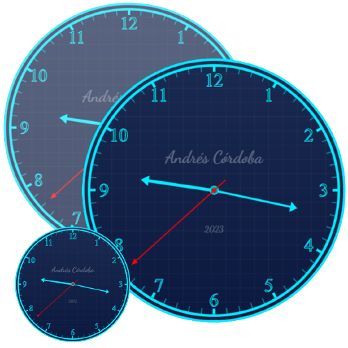
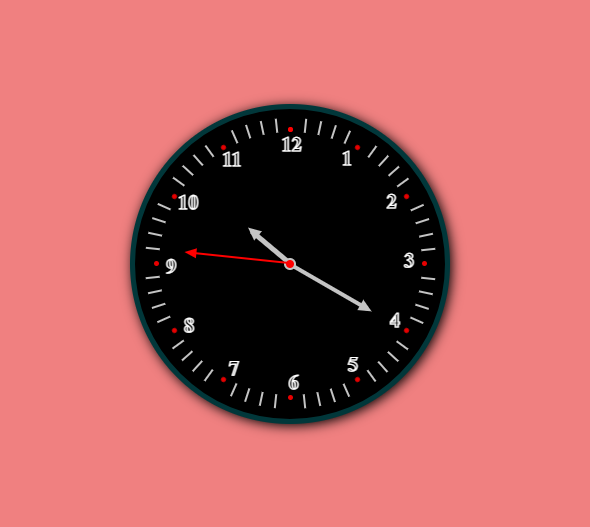

# Analog clock

This project consists of an analog clock with hands that shows the current time. It is implemented with HTML, CSS, and JavaScript, and uses the native JavaScript Date and Time API to get the current time.

Characteristics:

- Intuitive and easy to use user interface.
- Smooth and fluid animation of the hands.
- Display of the current time in 12-hour format.
- Scalability and customization through CSS.
- 
 # Views



# Facility

1. Clone this repository to your local machine:

```
git clone https://github.com/username/repo.git
```

2. Open the `index.html` file in your web browser.

# Use

When you open the `index.html` file, the analog clock is automatically displayed. The hands move in real time to reflect the current time, based on your device's time zone.

# Contribution

If you want to contribute to this project, follow these steps:

1. Fork this repository.
2. Create a new branch with your username.
3. Implement your changes and improvements.
4. Send a Pull Request to the `main` branch of this repository.

We appreciate any contribution and collaboration to improve this project.

# License

This project is under the MIT license. You may modify, copy and distribute this project under the terms of the license. See the `LICENSE` file for more details.
